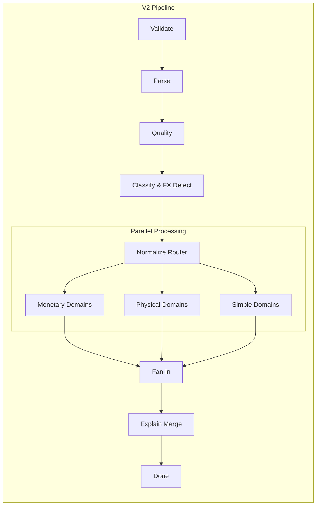
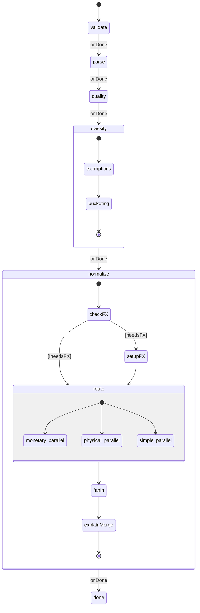

<p align="center">
  
</p>

# Tellimer Open Source Monorepo

[](https://codecov.io/github/Tellimer/open-source)

This monorepo contains various packages and applications maintained by Tellimer.

## Structure

```
monorepo/
├── packages/          # Open source libraries
│   ├── econify/       # Economic data processing toolkit (201 tests)
│   └── countrify/     # Country flag emoji utilities
│
└── apps/              # Applications (e.g. demos)
```

## Packages

### [@tellimer/countrify](packages/countrify)

[](https://jsr.io/@tellimer/countrify)
[](https://jsr.io/@tellimer/countrify)

A comprehensive library for working with country flag emojis in Deno. Provides
utilities for:

- Getting country by slug (lowercase, hyphen-separated)
- Searching countries by slug
- Supporting ISO 3166-1 alpha-2 and alpha-3 codes
- Including country dial codes

[View Package →](packages/countrify)

### [@tellimer/econify](packages/econify)

[](https://jsr.io/@tellimer/econify)
[](https://codecov.io/github/Tellimer/open-source)

[](https://github.com/Tellimer/open-source)
[](https://github.com/Tellimer/open-source)

A comprehensive Deno/TypeScript package for **economic data processing** with
advanced features for classification, normalization, quality assessment, and
analysis. Now includes **V2 workflows** with enhanced parallel processing and
explicit state management using XState v5.

#### Key Features:

- 🔍 **Smart Classification** — Automatically detect indicator types (stock,
  flow, rate, currency) and route to appropriate processing domains
- 🎯 **Auto-targeting** — Intelligent unit detection with precedence: unit time
  token → periodicity → tie-breaker defaults
- 💱 **FX Conversion** — Built-in currency conversion with live/fallback rates
  support
- 📊 **Domain-specific Processing** — Specialized handlers for 11+ domains:
  monetary, counts, percentages, indices, ratios, energy, commodities,
  agriculture, metals, crypto
- ⚡ **V2 Parallel Architecture** — Maximum parallelization with fan-out/fan-in
  pattern for optimal performance
- 🔄 **State Machine Orchestration** — Explicit state transitions using XState
  v5 for predictable, testable workflows
- 📈 **Quality Assessment** — Data quality scoring with detailed metrics and
  confidence levels
- 🌍 **International Support** — 150+ currency codes, 200+ countries, multiple
  languages
- 📝 **Explain Metadata** — Detailed transformation tracking with flat
  normalized keys (USD, millions, month)

#### V2 Architecture (New!)

The V2 workflow engine (`PipelineConfig.engine = "v2"`) provides significant
improvements:



**V2 Benefits:**

- FX detection during classification (not during processing)
- All domains process in parallel (not sequential)
- Explicit state transitions with guards
- Unified monetary pipeline (wages included)
- Flat explain metadata structure
- Better error handling and recovery

[View Package →](packages/econify)

## Apps

### Countrify Demo

A demo web application showcasing the @tellimer/countrify package capabilities -
coming soon!

## Econify V2 Workflow Architecture

### Overview

The V2 workflow engine represents a complete architectural redesign focused on
parallelization, explicit state management, and improved developer experience.
Built on XState v5, it provides predictable, testable, and highly performant
economic data processing.

### Domain Classification Taxonomy

V2 introduces a refined 11-domain taxonomy:

| Domain            | Description                           | FX Required | Example Indicators               |
| ----------------- | ------------------------------------- | ----------- | -------------------------------- |
| **monetaryStock** | Currency-based stocks                 | Always      | GDP, debt, reserves              |
| **monetaryFlow**  | Currency-based flows (includes wages) | Always      | Income, expenditure, salaries    |
| **counts**        | Count-based indicators                | Never       | Population, vehicles, facilities |
| **percentages**   | Percentage values                     | Never       | Unemployment rate, inflation     |
| **indices**       | Index values                          | Never       | CPI, stock indices               |
| **ratios**        | Composite ratios                      | Never       | Density (persons/km²)            |
| **energy**        | Energy & emissions                    | Conditional | GWh, CO2e, oil rigs              |
| **commodities**   | Commodity prices                      | Conditional | Oil ($/barrel), gold ($/oz)      |
| **agriculture**   | Agricultural products                 | Conditional | Wheat ($/bushel), corn           |
| **metals**        | Metal commodities                     | Conditional | Silver, copper, steel            |
| **crypto**        | Cryptocurrency                        | Conditional | BTC, ETH, SOL                    |

### Pipeline State Machine

<details>
<summary>View Complete Pipeline State Diagram</summary>



</details>

### Key Improvements Over V1

| Aspect                 | V1                   | V2                         |
| ---------------------- | -------------------- | -------------------------- |
| **FX Processing**      | Sequential, blocking | Parallel, non-blocking     |
| **State Management**   | Implicit conditions  | Explicit XState machines   |
| **Domain Processing**  | Sequential pipeline  | Parallel fan-out/fan-in    |
| **Wages Handling**     | Separate domain      | Unified as monetaryFlow    |
| **Error Recovery**     | Limited              | Comprehensive error states |
| **Metadata Structure** | Nested               | Flat with normalized keys  |
| **Testing**            | Integration-focused  | Unit-testable states       |

### Migration Guide

To use V2 workflows:

```typescript
import { econify } from "@tellimer/econify";

const result = await econify({
  config: {
    engine: "v2", // Enable V2 engine
    targetCurrency: "USD",
    targetScale: "millions",
    targetTimeScale: "month",
    autoTarget: true,
  },
  data: [/* your data */],
});
```

## Development

This is a Deno workspace using Deno 2.0+ workspace features.

### Getting Started

```bash
# Run tests for specific packages
deno task test:countrify
deno task test:econify

# Development mode for packages
deno task dev:countrify
deno task dev:econify

# Run all tests
cd packages/econify && deno test --allow-all
cd packages/countrify && deno test

# Format and lint code
deno fmt
deno lint
```

### Available Tasks

- `dev:countrify` - Run countrify in development mode with watch
- `dev:econify` - Run econify in development mode with watch
- `test:countrify` - Run countrify tests
- `test:econify` - Run econify tests

## Contributing

Please read our [Contributing Guide](CONTRIBUTING.md) for details on our code of
conduct and the process for submitting pull requests.

## License

This project is licensed under the MIT License - see the [LICENSE](LICENSE) file
for details.
