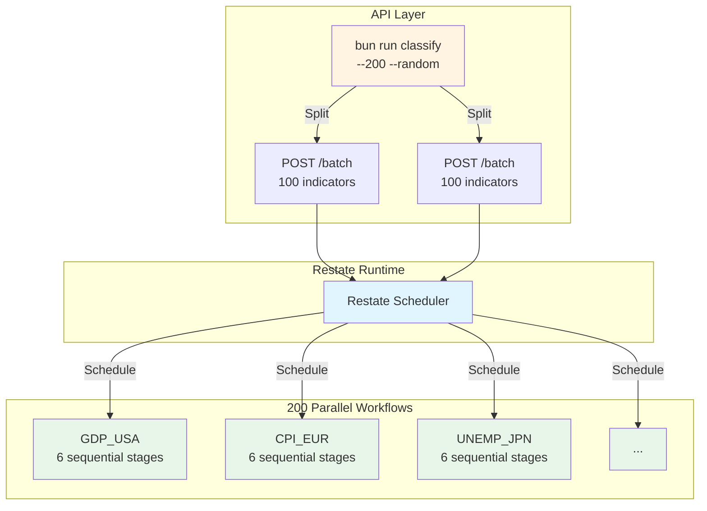

# Parallel Execution in Restate

How Restate handles parallelism for indicator classification.

## TL;DR

✅ **Automatic parallelism** - Restate schedules workflows across available resources
✅ **Fire-and-forget pattern** - API returns in <10ms, workflows run in background
✅ **200 parallel workflows** - One workflow per indicator, all execute simultaneously
✅ **Sequential stages** - Within each workflow, 6 stages run one after another
✅ **Unlimited scale** - Send multiple batches for 1000+ indicators

## How It Works

```
1 API Request (200 indicators)
        ↓
classify script splits into 2 batches of 100
        ↓
2 HTTP calls to /classify-api/batch
        ↓
Restate creates 200 workflow instances
        ↓
All 200 workflows execute in parallel
        ↓
Each workflow runs 6 stages sequentially
        ↓
Complete in 60-120 seconds
```

## Visual



## Code Implementation

### API Handler (Fire-and-Forget)

**[src/api/classify.api.ts](../src/api/classify.api.ts)**

```typescript
for (const indicator of indicators) {
  // workflowSendClient() returns immediately (non-blocking)
  ctx.workflowSendClient({
    name: "classification-workflow",
  }, indicator.indicator_id).run({
    ...indicator,
    llm_provider,
  });
}

// API returns in ~10ms
return { message: "Classification started", count: indicators.length };
```

### Workflow Handler (Sequential Stages)

**[src/workflows/classification.workflow.ts](../src/workflows/classification.workflow.ts)**

```typescript
const workflow = restate.workflow({
  name: "classification-workflow",
  handlers: {
    run: async (ctx: WorkflowContext, input) => {
      // Each indicator gets unique workflow instance
      const indicator_id = ctx.key;

      // 6 stages run sequentially (each needs previous results)
      const norm = await ctx.serviceClient(...).normalize(input);
      const time = await ctx.serviceClient(...).infer({ ...input, ...norm });
      const family = await ctx.serviceClient(...).assign({ ...input, ...norm, ...time });
      const type = await ctx.serviceClient(...).classify({ ...input, ...family });
      const bool = await ctx.serviceClient(...).review({ ...input, ...type });
      const final = await ctx.serviceClient(...).review({ ...input, ...bool });

      return final;
    },
  },
});
```

## Parallelism Guarantees

| Level | Behavior |
|-------|----------|
| **Across indicators** | Parallel - 200 workflows run simultaneously |
| **Within workflow** | Sequential - 6 stages one after another |
| **Service calls** | Parallel-safe - Multiple workflows can call same service |
| **Database writes** | Isolated - Each workflow writes to different indicator_id |
| **Failures** | Independent - One failure doesn't affect others |
| **Retries** | Automatic - Restate retries failed workflows |

## Scaling Examples

### 200 Indicators

```bash
bun run classify -- --200 --random --openai
```

```
T+0s:  Command starts
T+1s:  Batch 1 submitted (100)
T+1s:  Batch 2 submitted (100)
T+2s:  Command completes
T+5s:  All 200 workflows started
T+60s: ~150 completed (75%)
T+120s: 200 completed (100%)
```

### 1,000 Indicators

Script automatically splits into 10 batches:

```bash
bun run classify -- --1000 --random --openai
```

```
10 batches × 100 indicators = 1,000 parallel workflows
Still completes in ~60-120 seconds (not 10× longer)
```

### Multiple Batches Concurrently

For even higher throughput:

```bash
# Terminal 1
bun run classify -- --1000 --random --openai &

# Terminal 2
bun run classify -- --1000 --random --openai &

# Result: 2,000 parallel workflows
```

## Why Fire-and-Forget?

### ❌ Blocking (Bad)

```typescript
// Would take 25-50 MINUTES for 100 indicators
for (const indicator of indicators) {
  await ctx.workflowClient(...).run(indicator); // Blocks 15-30s each
}
```

### ✅ Fire-and-Forget (Good)

```typescript
// Takes ~10ms, workflows run in background
for (const indicator of indicators) {
  ctx.workflowSendClient(...).run(indicator); // Non-blocking
}
```

**Benefits:**
- API returns immediately (better UX)
- Client doesn't timeout
- Workflows survive API handler completion
- Query status later via `/getStatus`
- Monitor via Restate Admin UI

## Monitoring

### 1. Restate Admin UI

```bash
open http://localhost:9070
```

Navigate: **Invocations** → Filter "classification-workflow"

See:
- All 200 workflows listed
- Current stage of each
- Real-time progress
- Drill into workflow state
- View errors

### 2. Database Queries

**Progress:**
```sql
SELECT COUNT(*) as completed FROM classifications;
```

**By stage:**
```sql
SELECT
  CASE
    WHEN n.indicator_id IS NULL THEN 'normalizing'
    WHEN t.indicator_id IS NULL THEN 'time-inferring'
    WHEN f.indicator_id IS NULL THEN 'family-assigning'
    WHEN ty.indicator_id IS NULL THEN 'type-classifying'
    WHEN b.indicator_id IS NULL THEN 'reviewing'
    WHEN fr.indicator_id IS NULL THEN 'final-reviewing'
    ELSE 'completed'
  END as stage,
  COUNT(*) as count
FROM source_indicators si
LEFT JOIN normalization_results n ON si.id = n.indicator_id
LEFT JOIN time_inference_results t ON si.id = t.indicator_id
LEFT JOIN family_assignment_results f ON si.id = f.indicator_id
LEFT JOIN type_classification_results ty ON si.id = ty.indicator_id
LEFT JOIN boolean_review_results b ON si.id = b.indicator_id
LEFT JOIN final_review_results fr ON si.id = fr.indicator_id
WHERE n.indicator_id IS NOT NULL
GROUP BY stage;
```

## Performance

| Metric | Value |
|--------|-------|
| **API response** | <10ms |
| **Per workflow** | 12-30 seconds |
| **200 indicators** | 60-120 seconds total |
| **1,000 indicators** | 60-120 seconds total (still parallel!) |
| **Bottleneck** | LLM API latency |
| **Max throughput** | Limited by LLM rate limits |

## Key Takeaways

1. **Automatic parallelism** - No manual thread/queue management
2. **Fire-and-forget** - API returns immediately
3. **Workflow isolation** - Each indicator independent
4. **Sequential stages** - Within workflow (dependencies)
5. **Unlimited scale** - Cluster scales horizontally
6. **Full observability** - Monitor via UI or database
7. **Fault tolerance** - Failures don't affect others

## Further Reading

- **[QUICKSTART.md](QUICKSTART.md)** - Setup guide
- **[Restate Workflows](https://docs.restate.dev/concepts/workflows)** - Official docs
- **[Restate Parallelism](https://docs.restate.dev/concepts/invocations#concurrent-invocations)** - Concurrency guide
