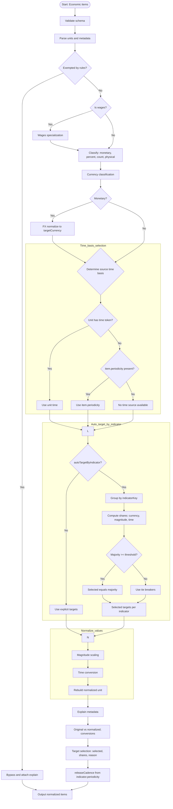
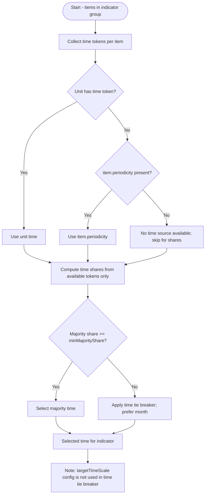
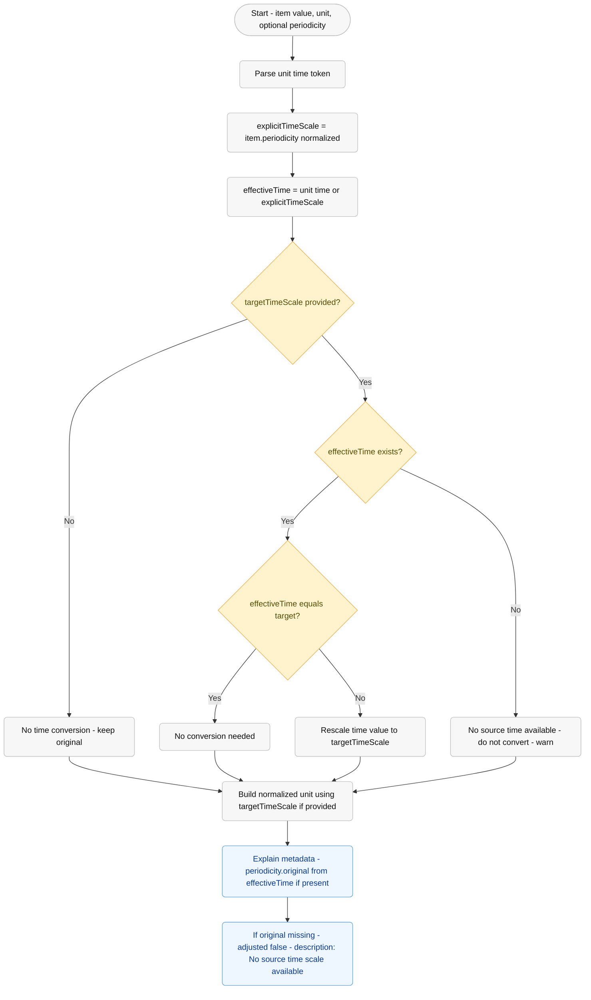
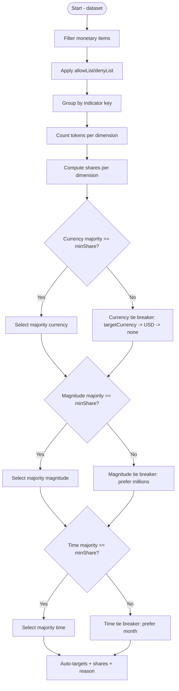

# Econify Internal Brief

Audience: product/engineering management. What Econify does, how it decides
targets, and how to interpret outputs.

## TL;DR

- We ingest economic series, classify them (monetary/percent/count/physical),
  normalize currency (FX), magnitude (k/M/B), and time basis (per
  month/quarter/year) for comparability.
- Auto‑targeting by indicator chooses majority units per indicator (currency,
  magnitude, time) or applies tie‑breakers when silent.
- Time basis when unit is silent (actual code): unit time token →
  item.periodicity; auto‑target tie‑breaker still prefer‑month when no majority.
  No indicator.periodicity fallback today.
- Explain metadata shows what was selected, why, and the exact conversions
  applied. Share keys are canonicalized (USD, millions, month).

---

## Flow diagram



---

## Classification: stock, flow, counts

- Monetary: values with a currency (e.g., USD Million). Subject to FX and
  magnitude/time normalization.
- Percent: dimensionless (%, pp). FX skipped; magnitude/time usually N/A.
- Counts: units like Units, Thousand Units, people. No FX; magnitude scaling may
  apply.
- Physical: barrels, tons, kWh, etc. No FX unless combined with currency in
  compound rates.
- Wages: specialized path (normalized to currency per month; your defaults
  prefer monthly display).

## Currency handling

- Detection: from unit tokens, explicit currency_code, or metadata.
- Conversion: FX to targetCurrency (e.g., USD) using live or fallback rates.
- Output: normalized currency + magnitude + time forms a canonical unit string.

## Time basis selection (when unit is silent) — actual code today

Priority order:

1. Use explicit unit time token if present (per month/quarter/year).
2. Else, use item.periodicity if populated (Monthly/Quarterly/Yearly).
3. Else, auto-target tie-breaker selects "month" (hardcoded prefer-month).

Notes:

- There is no indicator.periodicity fallback implemented today.
- Tie-breaker does not use pipeline targetTimeScale.
- When normalizing a single item and targetTimeScale is set but no source time
  is available (no unit token and no item.periodicity), the value is NOT
  time-converted; we only set the normalized unit to include per targetTimeScale
  and emit a warning. Explain metadata sets periodicity.adjusted=false with
  description "No source time scale available".

### Micro-flow: Auto-target time basis



Note: This precedence reflects current code in computeAutoTargets
(auto-targeting). Per-item normalization prefers unit time token over
item.periodicity.

### Micro-flow: Per-item time normalization



## Auto‑target by indicator

- Purpose: make rows within the same indicator comparable by selecting a common
  target per indicator.
- Dimensions: currency, magnitude, time (each can be included/excluded). Common
  config is force currency globally and auto‑target magnitude+time.
- Shares: we compute shares per dimension across the indicator’s items.
- Selection:
  - If a majority ≥ minMajorityShare exists, choose it.
  - Otherwise use tie‑breakers (e.g., magnitude prefer‑millions, time
    prefer‑month).
- Gating: allowList/denyList to control which indicators are auto‑targeted.
- Explain: includes selected, shares (keys normalized to USD, millions, month,
  …), and reason.

### Micro-flow: Auto-target selection (currency, magnitude, time)



## Normalization steps

1. Magnitude scaling (thousands ↔ millions ↔ billions).
2. Time conversion (year ↔ quarter ↔ month) using consistent factors.
3. Unit reconstruction and metadata emission.

## Explain metadata highlights

- original vs normalized units
- conversion steps and factors (e.g., year → month ÷12)
- targetSelection: selected values, shares, reason, indicatorKey
- releaseCadence: DB‑level periodicity for clarity
- share keys canonicalized: USD/EUR/JPY; thousands/millions/billions;
  month/quarter/year

## Examples from staging (indicator → units, periodicity)

| Indicator         | Units                  | Periodicity                                         |
| ----------------- | ---------------------- | --------------------------------------------------- |
| GDP               | USD Billion            | Yearly                                              |
| Balance of Trade  | USD Million            | Monthly/Quarterly/Yearly (varies by country/source) |
| API Crude Imports | BBL/1Million           | Weekly                                              |
| Auto Exports      | Thousand Units / Units | Monthly                                             |

## Typical configuration (force USD, auto‑target magnitude+time)

```ts
const options: PipelineOptions = {
  targetCurrency: "USD",
  autoTargetByIndicator: true,
  autoTargetDimensions: ["magnitude", "time"],
  indicatorKey: "name",
  minMajorityShare: 0.6,
  tieBreakers: { magnitude: "prefer-millions", time: "prefer-month" },
  explain: true,
};
```

## Fallback recommendation

Enable or adopt the fallback to indicator.periodicity when:

- Unit lacks a time token and item.periodicity is missing.
- This avoids arbitrary tie‑breaks and aligns GDP‑like series to “year”.

## Contact

For adjustments (e.g., prefer‑year tie‑breaker, business‑specific defaults),
contact the Econify maintainers.
