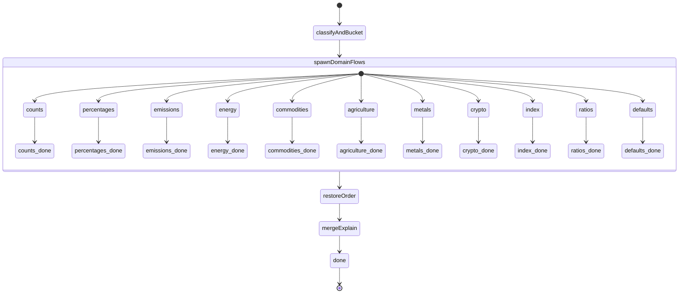
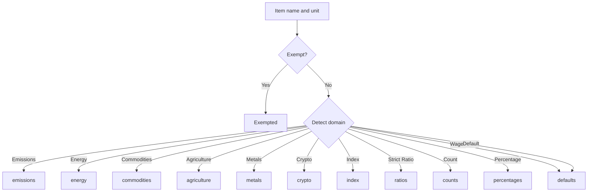
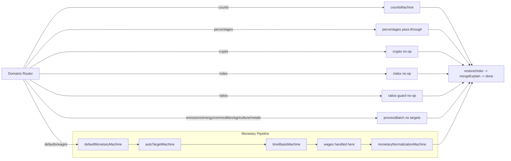

# Domains Router State Machine (packages/econify/src/workflows/machines/domains/domains_router.machine.ts)

## Purpose and Role
The Domains Router is the fan-out/fan-in coordinator in the Econify pipeline. It:
- Classifies each input indicator into a domain (counts, percentages, emissions, energy, commodities, agriculture, metals, crypto, index, ratios, defaults)
- Launches domain-specific processing in parallel for each bucket
- Preserves the original order of non‑exempted items on the way out and appends exempted items
- Merges lightweight explain annotations so each output carries its domain and router provenance; preserves any existing explain

Inputs: `{ config, parsedData, fxRates?, fxSource?, fxSourceId?, explain? }`

Output: `{ normalizedData: ParsedData[] }`

## High-Level Flow
1. classifyAndBucket — Partition data into domain buckets and split exempt vs non‑exempt
2. spawnDomainFlows (parallel) — Run domain sub‑machines or batch handlers concurrently per bucket
3. restoreOrder — Reassemble outputs to match original order of non‑exempt items; append exempted
4. mergeExplain — Add `explain.domain`, `explain.router = "domains-router"`, and exemption flags
5. done — Return `{ normalizedData }`

---

## Stage-by-Stage Breakdown

### 1) Partition (classifyAndBucket)
- Runs filterExemptions to split `{ exempted, nonExempted }` based on config rules
- Builds `buckets` from non‑exempted using heuristics:
  - Parse unit via `parseUnit(unit)` for category, currency, scale, time
  - Optionally parse domain via `parseWithCustomUnits()` (e.g., emissions, commodity families)
  - Regex/name hints to identify emissions, energy, commodities, agriculture, metals, crypto
  - `isCountIndicator(name, unit)`/`isCountUnit(unit)` for count detection
  - Percentages by parsed category
  - Strict ratios when unit has a “/”, category is composite, and there’s no timeScale
  - Index by parsed category
  - Everything else → defaults (monetary pipeline)

Buckets recorded with original indices so order can be restored later.

### 2) Process (spawnDomainFlows)
Runs as a parallel state; each bucket is handled independently and returns a processed list.
- counts → countsMachine
  - Scale-only normalization to `ones` (no currency/time conversion)
  - Output shape: `{ processed: ParsedData[] }`
- percentages → percentagesMachine
  - Validation + pass-through (dimensionless). Unit normalized to `%` by engine.
- emissions, energy, commodities, agriculture, metals → processBatch (no targets)
  - No target currency/magnitude/time passed, so values remain numerically unchanged
  - Normalized unit string is standardized; explain added if enabled
- crypto → cryptoMachine
  - Explicit no‑op; when explain is on, annotates note = "no-op normalization"
- index → indexDomainMachine
  - Explicit no‑op for indices/points; same annotate behavior as crypto
- ratios → ratiosMachine
  - Guards composite units and annotates note = "no-op normalization (guarded ratio)"
- defaults → defaultMonetaryMachine
  - Full monetary pipeline with auto-targeting and time-basis selection
  - May group by indicator and select targets per series; performs FX/scale/time normalization

Each sub-state resolves to `final`, then the overall parallel state moves on when all sub‑states complete.

### 3) Restore Original Order (restoreOrder)
- Uses each bucket’s original indices to place processed outputs back into their original positions among non‑exempted items
- Fills any gaps with the original non‑exempted items (pass‑through safety)
- Appends exempted items to the end

### 4) Merge Explain (mergeExplain)
- If explain is enabled, annotates each output with:
  - `domain`: one of counts, percentages, emissions, energy, commodities, agriculture, metals, crypto, index, ratios, defaults
  - `router`: "domains-router"
  - `exempted: true` for exempted items
- If a domain machine returned pass‑through references, a fallback classifier attempts to infer the domain for explain purposes (crypto, index, ratios)
- Existing explain is preserved and only augmented where fields are not already set

### 5) Done
- Final state that outputs `{ normalizedData }` from context

---

## Sub‑Machine Relationships and Responsibilities

- countsMachine (domains/counts/counts.machine.ts)
  - Scale to `ones`; no currency/time conversion; returns `{ processed }`
- percentagesMachine (domains/percentages/percentages.machine.ts)
  - Pass-through with validation; dimensionless handling
- cryptoMachine (domains/crypto/crypto.machine.ts)
  - No‑op; if `explain` is on, adds `{ domain: "crypto", note: "no-op normalization" }`
- indexDomainMachine (domains/index/index.machine.ts)
  - No‑op; if `explain` is on, adds `{ domain: "index", note: "no-op normalization" }`
- ratiosMachine (domains/ratios/ratios.machine.ts)
  - Light guard for composite units (e.g., USD/Liter) and annotate; no FX/time normalization
- defaultMonetaryMachine (domains/monetary/default_monetary.machine.ts)
  - Orchestrates monetary normalization for `defaults` bucket:
    - autoTargetMachine — computes per‑indicator targets (currency, magnitude, time) when enabled
    - timeBasisMachine — selects preferred time scale using config, unit time, periodicity, and tie‑breakers (e.g., prefer‑month)
    - monetaryNormalizationMachine — groups by indicator, applies selected targets, runs processBatch, and enriches explain (FX source, targetSelection)

### Where wages are processed
- Wages are monetary indicators with currency per time units (e.g., USD/Hour, EUR/Week).
- They are handled in the defaults lane via the monetary pipeline, not the ratios lane.
- Flow: defaultMonetaryMachine → autoTargetMachine → timeBasisMachine (work‑hours aware, e.g., 173.33 hours/month) → monetaryNormalizationMachine (FX + magnitude). Tie‑breakers default to prefer‑month.

### What “defaults” processing is
- The defaults lane triggers the monetary normalization pipeline for genuinely monetary series (GDP, debt, trade, revenue, wages, etc.).
- It selects target currency, magnitude, and time basis (autoTargetMachine), chooses the preferred time basis (timeBasisMachine), then performs FX, magnitude, and time normalization with explain enrichment (monetaryNormalizationMachine).
- FX provenance (source and as‑of dates when provided) is carried into explain; auto‑target selections are included under `explain.targetSelection` when enabled.

---

## Non‑Technical Explanation (for Business Stakeholders)

Think of the Domains Router as a dispatcher that sends each indicator down the right lane so we don’t perform nonsensical conversions:
- Percentages are left as percentages — no currency or time conversion
- Counts (like car registrations) are standardized to a common scale (e.g., ones), but not converted to currencies
- Index values and crypto are passed through unchanged (with clear labeling)
- Physical quantities (energy, commodities, agriculture, metals) are kept in their original physical units — we do not convert barrels to dollars here
- Everything genuinely monetary (like GDP, exports, debt) goes through the monetary lane, where we can convert currency, scale, and time basis consistently

At the end, we stitch results back together in the original order and attach a simple label indicating which lane each item took. This yields consistent, trustworthy outputs without over‑processing the wrong types of indicators.

---

## Visual Documentation (Mermaid)

### Overall State Machine Flow

### Routing by Indicator Type (Bucketing)

### Router ↔ Sub‑Machines

---

## Implementation Notes & Guarantees
- Preserves original order across concurrent domain processing using bucket indices
- Safe pass‑through: if a child returns fewer items than the bucket size, gaps are filled with originals
- Domain labels and router provenance are added only when not already set; existing explain is preserved
- Exempted items are flagged and appended to the output
- Crypto, index, ratios are explicit no‑ops; counts are scale‑only; physical domains avoid FX and time conversion
- Monetary defaults integrate auto‑targeting and prefer‑month tie‑breaker via timeBasisMachine

## Configuration Touchpoints
- Exemptions: `config.exemptions` (filterExemptions)
- Explain: `config.explain` controls annotation across all paths
- Monetary targets: `config.targetCurrency`, `config.targetMagnitude`, `config.targetTimeScale`
- Auto‑targeting: `config.autoTargetByIndicator`, `config.indicatorKey`, `config.autoTargetDimensions`, `config.minMajorityShare`, `config.tieBreakers`
- FX provenance in explain: `fxSource`, `fxSourceId` propagated to monetary outputs

## Extending the Router
To add a new domain lane:
1) Extend `Buckets` with a new bucket and update the classifier (partition actor)
2) Add a parallel sub‑state in `spawnDomainFlows` invoking your new machine
3) Capture results in context and place them during `restoreOrder`
4) Update `mergeExplain` to map outputs to the new `domain` label when enabled

---

## Documentation Audit
- Prior docs (README, docs/*) did not explain the Domains Router’s orchestration. This document adds a full technical + business overview, visuals, and extension guidance.
- README already communicates counts and wages behavior; percentages/indices/crypto pass‑through behavior is now clearly documented here.
- No conflicting claims were found about domain processing; we recommend linking to this file from the README (added in this change).

