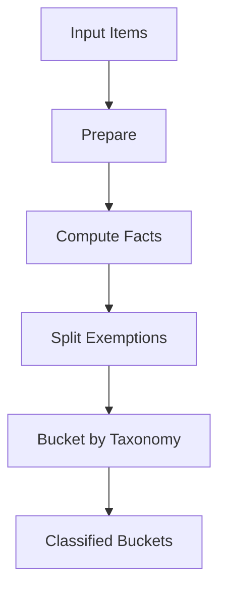
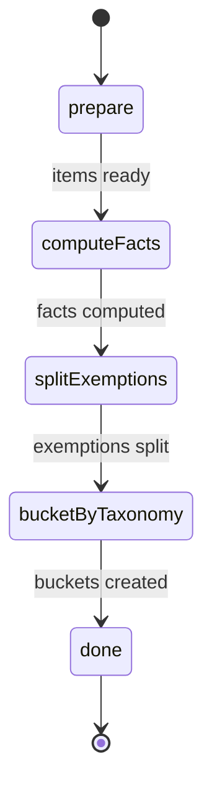
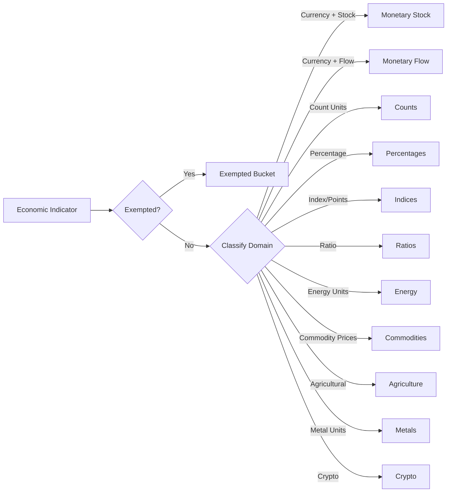
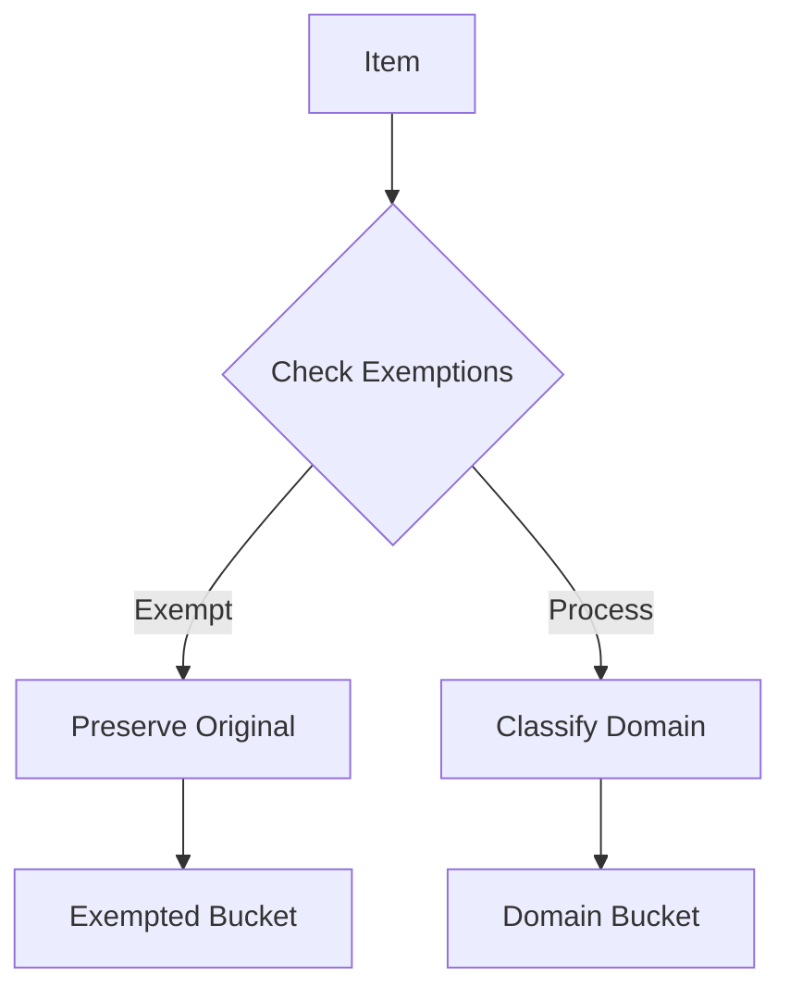

# Classification System

The classification system is the heart of V2's domain-aware processing. It
replaces V1's imperative conditionals with explicit state transitions and
unified taxonomy.

## Architecture



## Classification Machine (`classify.machine.ts`)

### States



### State Descriptions

- **prepare**: Initialize classification context
- **computeFacts**: Analyze each item to determine domain facts
- **splitExemptions**: Separate exempted items from processable items
- **bucketByTaxonomy**: Group items into domain-specific buckets
- **done**: Return classified buckets ready for processing

## Taxonomy System

### Domain Classification



### Classification Rules

#### Monetary Stock

- **Criteria**: Currency units + stock semantics
- **Examples**: GDP, debt levels, reserves, market capitalization
- **Units**: USD, EUR, GBP + magnitude (millions, billions)
- **Processing**: Full monetary normalization (currency, magnitude, no time
  conversion)

#### Monetary Flow

- **Criteria**: Currency units + flow semantics OR wages
- **Examples**: Trade balance, wages, revenue, cash flow
- **Units**: Currency per time period (USD per year, EUR per month)
- **Processing**: Full monetary normalization including time basis conversion

#### Counts

- **Criteria**: Count-based units
- **Examples**: Population, vehicles, households, births
- **Units**: people, vehicles, units, head (livestock)
- **Processing**: Magnitude scaling only, preserve count semantics

#### Percentages

- **Criteria**: Percentage or rate units
- **Examples**: Unemployment rate, inflation, interest rates
- **Units**: %, percent, basis points
- **Processing**: Pass-through, preserve percentage values

#### Indices

- **Criteria**: Index or points units
- **Examples**: CPI, PMI, stock indices
- **Units**: index, points, index points
- **Processing**: Pass-through, preserve index values

#### Ratios

- **Criteria**: Explicit ratio units
- **Examples**: Debt-to-GDP, P/E ratio, current ratio
- **Units**: ratio, multiple
- **Processing**: Pass-through, preserve ratio values

#### Physical Domains

- **Energy**: TWh, bcm, barrels per day
- **Commodities**: USD per barrel, USD per ounce (prices)
- **Agriculture**: tonnes, bushels per acre, head (livestock)
- **Metals**: tonnes, USD per tonne
- **Crypto**: USD per BTC, USD per ETH

## Facts Computation (`taxonomy.ts`)

The facts computation system analyzes each indicator to determine its domain:

```typescript
interface ClassificationFacts {
  hasCurrency: boolean;
  hasTimeScale: boolean;
  isCount: boolean;
  isPercentage: boolean;
  isIndex: boolean;
  isRatio: boolean;
  isPhysical: boolean;
  isCrypto: boolean;
  isWage: boolean;
  domain: DomainType;
}
```

### Fact Detection Logic

1. **Currency Detection**: Parse unit for currency codes (USD, EUR, etc.)
2. **Time Scale Detection**: Look for time indicators (per year, monthly, etc.)
3. **Semantic Analysis**: Analyze indicator name and category for domain hints
4. **Unit Pattern Matching**: Match unit patterns against known domain patterns
5. **Wage Detection**: Special handling for wage/salary indicators
6. **Physical Unit Detection**: Match against physical unit dictionaries

## Exemptions System

### Exemption Rules

- **IMF WEO Indicators**: Skip normalization for World Economic Outlook data
- **Credit Ratings**: Preserve rating scales (AAA, Baa1, etc.)
- **Custom Indices**: User-defined exemption patterns
- **Name Patterns**: Regex-based exemption rules

### Exemption Processing



## Usage Example

```typescript
import { createActor } from "xstate";
import { classifyMachine } from "./classify.machine.ts";

const actor = createActor(classifyMachine, {
  input: {
    config: {
      engine: "v2",
      exemptions: ["IMF WEO", "Credit Rating"],
    },
    parsedData: [
      { value: 25000, unit: "USD billions", name: "GDP" },
      { value: 35000, unit: "GBP per year", name: "Average Wage" },
      { value: 3.5, unit: "percent", name: "Unemployment Rate" },
    ],
  },
});

actor.start();
// Returns buckets: { monetaryStock: [GDP], monetaryFlow: [Wage], percentages: [Unemployment] }
```

## Testing

Classification is tested with:

- All 11 domain types
- Exemption rules
- Edge cases and boundary conditions
- Mixed datasets
- Wage classification scenarios

## Migration from V1

### Key Changes

1. **Unified Taxonomy**: Single classification system (no separate wages
   handling)
2. **Explicit States**: State machine transitions instead of imperative logic
3. **Domain Awareness**: Semantic preservation per domain type
4. **Enhanced Facts**: Richer classification metadata

### Benefits

- **Predictable**: Explicit state transitions make behavior transparent
- **Extensible**: Easy to add new domains or classification rules
- **Testable**: Each state and transition can be tested independently
- **Maintainable**: Clear separation of concerns between classification and
  processing
