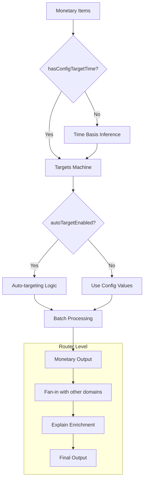
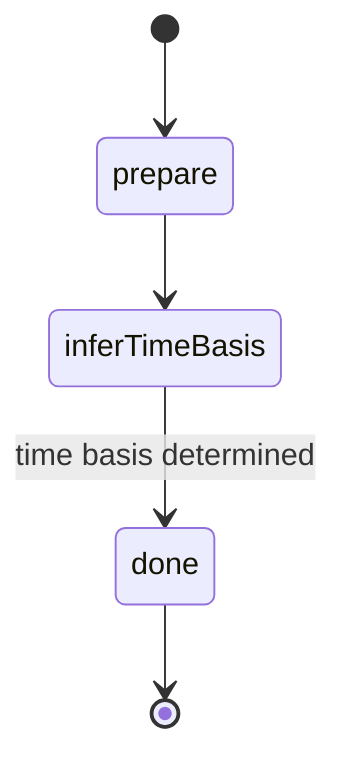
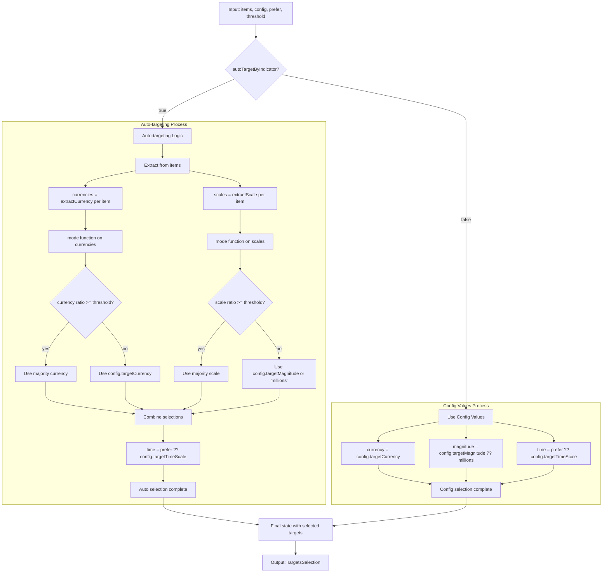
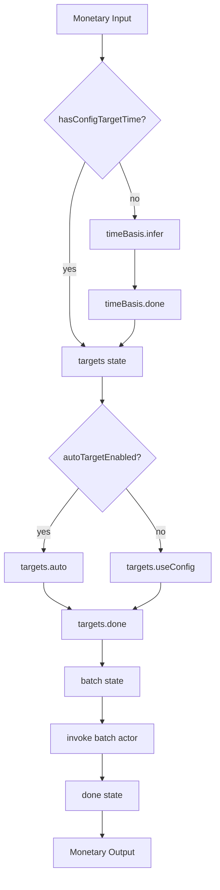

# Monetary Domain Pipeline

The monetary domain pipeline handles all currency-related indicators including
GDP, debt, trade balances, and wages. This unified pipeline eliminates the
arbitrary separation between wages and other monetary flows that existed in V1.

## Architecture



## State Machines

### Time Basis Machine (`time_basis.machine.ts`)

Determines the time scale for monetary flow indicators.

**States:**

- `prepare` → `inferTimeBasis` → `done`

**Logic:**

1. Check for explicit time scale in config
2. Infer from unit time tokens (per year, per month, etc.)
3. Apply majority inference across items
4. Fall back to prefer-month tie-breaker



### Auto Target Machine (`targets.machine.ts`)

Automatically determines target currency and magnitude based on majority rules
with configurable dominance thresholds.

#### 🎯 Purpose

The auto-targeting machine analyzes input data to determine optimal
normalization targets by finding majority patterns in currencies and scales,
enabling automatic standardization of mixed-currency datasets.

#### 🔧 Algorithm: Mode Function

The core logic uses a `mode()` function that:

1. **Counts occurrences** of each value (currency/scale) across all items
2. **Calculates ratio** = most_frequent_count / total_items
3. **Returns** the most frequent value and its dominance ratio

#### ⚖️ Decision Logic

**Auto-targeting Path** (`autoTargetByIndicator: true`):

- **Currency**: Use majority if ratio ≥ threshold (default 0.8), else fallback
  to config
- **Scale**: Use majority if ratio ≥ threshold, else fallback to config or
  "millions"
- **Time**: Always use `prefer` parameter (from time_basis) or config

**Config Path** (`autoTargetByIndicator: false`):

- **Currency**: `config.targetCurrency`
- **Scale**: `config.targetMagnitude ?? "millions"`
- **Time**: `prefer ?? config.targetTimeScale`

#### 📊 Example Scenarios

**Scenario 1: Strong Majority (ratio ≥ 0.8)**

- Input: 10 items, 9 in EUR, 1 in USD
- Currency ratio: 9/10 = 0.9 ≥ 0.8 → **Select EUR**

**Scenario 2: No Clear Majority (ratio < 0.8)**

- Input: 10 items, 5 in EUR, 3 in USD, 2 in GBP
- Currency ratio: 5/10 = 0.5 < 0.8 → **Fallback to config.targetCurrency**

**Scenario 3: Mixed Scales**

- Input: 8 items in millions, 2 in thousands
- Scale ratio: 8/10 = 0.8 ≥ 0.8 → **Select "millions"**

#### State Machine Flow



#### 💡 Key Design Decisions

1. **Threshold-based**: Uses 80% dominance threshold to ensure clear majority
2. **Graceful Fallback**: Always has config values as backup
3. **Time Preference**: Respects time_basis machine output over config
4. **Stateless Logic**: All computation happens in entry action, then
   immediately transitions to done

### Monetary Machine (`monetary.machine.ts`)

Orchestrates the complete monetary processing pipeline with explicit state
transitions.

**Flow:**

1. Time basis inference (conditional on config)
2. Auto-targeting (if enabled) or config values
3. Batch normalization with FX conversion

**Note**: Explain metadata enrichment happens at the router level after all
domains complete, not within the monetary machine.



## Key Features

### Unified Processing

- **Wages**: Treated as monetary flow indicators (no special handling)
- **GDP/Debt**: Processed as monetary stock indicators
- **Trade**: Processed based on flow/stock classification

### Time Scale Handling

- **Flow Indicators**: Apply time basis conversion (wages, trade flows)
- **Stock Indicators**: No time conversion (GDP, debt levels)
- **Automatic Detection**: Infers flow vs stock from indicator semantics

### Auto-Targeting

- **Currency**: Majority currency becomes target (e.g., 80% EUR → target EUR)
- **Magnitude**: Majority magnitude becomes target (e.g., 70% millions → target
  millions)
- **Tie-Breaking**: Configurable preferences for ambiguous cases

### Explain Metadata

- **FX Source**: Tracks whether live or fallback rates were used
- **Conversion Steps**: Detailed breakdown of currency, magnitude, and time
  conversions
- **Provenance**: Records auto-target decisions and majority calculations

## Usage Example

```typescript
import { createActor } from "xstate";
import { monetaryMachine } from "./monetary.machine.ts";

const actor = createActor(monetaryMachine, {
  input: {
    items: [
      { value: 35000, unit: "GBP per year", id: "wage-uk" },
      { value: 25000, unit: "USD billions", id: "gdp-usa" },
    ],
    config: {
      targetCurrency: "USD",
      targetMagnitude: "millions",
      targetTimeScale: "month",
      autoTargetByIndicator: false,
      fxRates: { GBP: 1.25 },
    },
  },
});

actor.start();
```

## Testing

The monetary pipeline is comprehensively tested with:

- Wage normalization scenarios
- Mixed currency datasets
- Auto-targeting behavior
- FX rate application
- Time basis inference
- Explain metadata generation

See `../../workflowsV2_test.ts` for complete test coverage.

## Migration from V1

### Key Changes

1. **Wages Integration**: No separate wages machine - wages processed as
   monetary flows
2. **Unified Explain**: Consistent explain metadata across all monetary
   indicators
3. **Auto-Targeting**: Enhanced auto-targeting with configurable tie-breakers
4. **Performance**: Faster processing through explicit state transitions

### Compatibility

- Input format remains the same
- Output structure enhanced with V2 explain metadata
- All V1 functionality preserved with improved semantics
