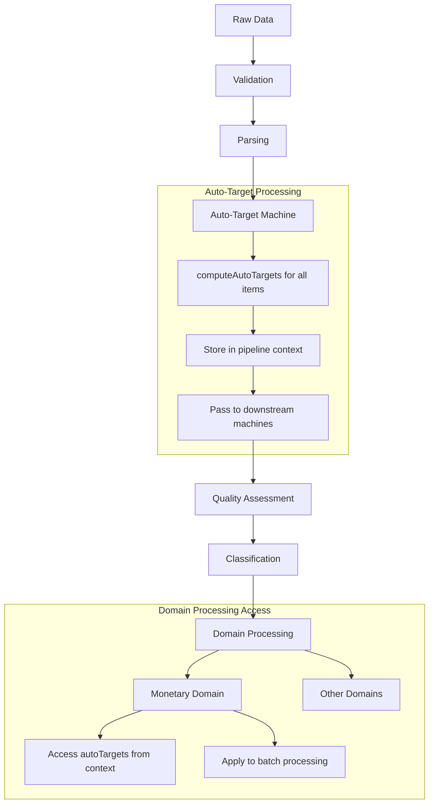
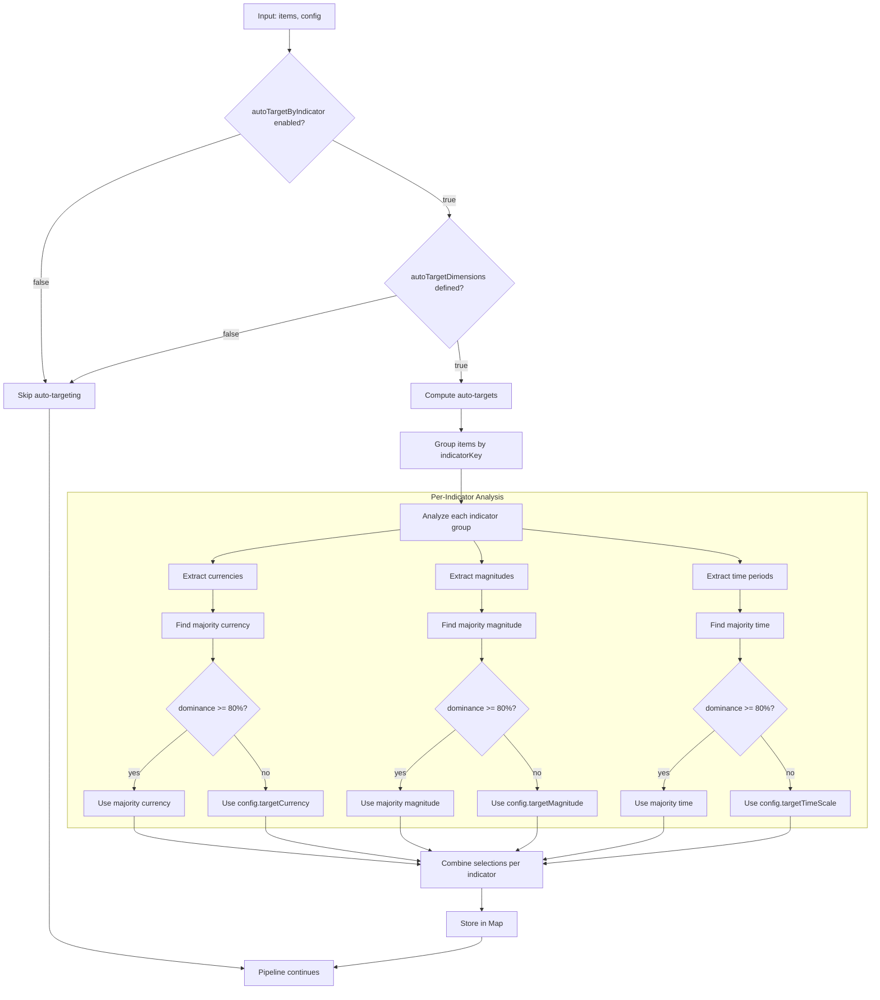

# Stage Machines

This directory contains the core pipeline stage machines for the V2 workflows engine.

## Auto-Target Machine

### Overview

The Auto-Target Machine is a critical component of the V2 pipeline that computes optimal normalization targets (currency, magnitude, time) across all indicators before any domain-specific processing begins.

**Location**: [`auto_target.machine.ts`](./auto_target.machine.ts)
**Pipeline Position**: Stage 3 (after parsing, before quality assessment)
**Purpose**: Global auto-targeting computation for consistent indicator-level normalization

### How Auto-Targeting Works

#### 🎯 **Global Auto-Target Computation (Pipeline Level)**

The auto-targeting happens **early in the pipeline** at the global level, not per-item:

```typescript
// Pipeline: validate → parse → autoTarget → quality → classify → normalize

// Auto-target machine computes targets ONCE for the entire dataset
const autoTargets = computeAutoTargets(allItems, config);
// Result: Map<indicatorName, targets>
// Example: Map { "Consumer Spending" => { currency: "USD", magnitude: "millions", time: "month" } }
```

#### 🔄 **Data Flow Through Pipeline**



#### 📊 **Target Computation Logic**



### Configuration

The auto-target machine is controlled by several configuration options:

```typescript
interface PipelineConfig {
  // Core auto-targeting control
  autoTargetByIndicator: boolean;           // Enable/disable auto-targeting
  autoTargetDimensions?: string[];          // Which dimensions to auto-target
  indicatorKey?: string;                    // Field to group indicators by (default: "name")

  // Targeting parameters
  minMajorityShare?: number;                // Dominance threshold (default: 0.8 = 80%)

  // Fallback values when auto-targeting disabled or no majority found
  targetCurrency?: string;                  // Fallback currency
  targetMagnitude?: string;                 // Fallback magnitude
  targetTimeScale?: string;                 // Fallback time scale

  // Tie-breaking preferences
  tieBreakers?: {
    currency?: 'prefer-USD' | 'prefer-targetCurrency';
    magnitude?: 'prefer-millions' | 'prefer-targetMagnitude';
    time?: 'prefer-month' | 'prefer-targetTimeScale';
  };
}
```

#### ⚠️ **V1 vs V2 Threshold Difference**

- **V2 uses 0.8 (80%)** threshold for auto-targeting dominance
- **V1 uses 0.5 (50%)** threshold (more permissive)
- This means V2 requires stronger majority consensus before auto-targeting
- V2 will fallback to config values more often than V1

### Data Flow Example

Let's trace how auto-targeting works for mixed currency data:

#### **Input Data:**
```typescript
[
  { id: "US", name: "Consumer Spending", value: 15000000, unit: "USD Million" },
  { id: "GB", name: "Consumer Spending", value: 2000000, unit: "USD Million" },
  { id: "DE", name: "Consumer Spending", value: 3500000, unit: "USD Million" },
  { id: "AF", name: "Consumer Spending", value: 1301129, unit: "AFN Million" },
]
```

#### **Step 1: Auto-Target Computation**
```typescript
// Auto-target machine runs computeAutoTargets()
const autoTargets = Map {
  "Consumer Spending" => {
    currency: "USD",           // 75% of items are USD (< 80%, but no other majority)
    magnitude: "millions",     // 100% are millions (> 80% threshold)
    time: "month",            // tie-breaker default
    reason: "currency=majority(USD,0.75); magnitude=majority(millions,1.00); time=tie-break(prefer-month)",
    shares: {
      currency: { USD: 0.75, AFN: 0.25 },
      magnitude: { millions: 1.0 },
      time: {}
    }
  }
}
```

#### **Step 2: Pipeline Context Storage**
```typescript
// In pipeline.machine.ts
autoTarget: {
  invoke: {
    src: "autoTargetMachine",
    onDone: {
      actions: [
        ({ event, self }) => {
          // Store auto-targets as side effect for downstream machines
          (self as any)._v2AutoTargets = event.output.autoTargets;
        },
      ],
    },
  },
}
```

#### **Step 3: Domain Processing Access**
```typescript
// In normalize_router.machine.ts
invoke: {
  src: "monetaryDomain",
  input: ({ self, context }) => {
    const autoTargets = (self as any)._v2AutoTargets; // Access from pipeline
    return {
      items: context.monetaryItems,
      config: context.config,
      autoTargets: autoTargets, // Pass to monetary domain
      fxRates: context.fxRates,
    };
  },
}
```

#### **Step 4: Monetary Domain Application**
```typescript
// In monetary.machine.ts
const targets = autoTargets.get("Consumer Spending");
if (targets) {
  // Apply to ALL Consumer Spending items
  await batchProcess(consumerSpendingItems, {
    toCurrency: targets.currency,    // "USD"
    toMagnitude: targets.magnitude,  // "millions"
    toTimeScale: targets.time,       // "month"
    // This converts AFN → USD for the AF item
  });
}
```

#### **Step 5: Result with Explain Metadata**
```typescript
[
  {
    id: "AF",
    name: "Consumer Spending",
    value: 1301129,                    // Original AFN value
    unit: "AFN Million",              // Original unit
    normalized: 92937785.71,          // Converted to USD
    normalizedUnit: "USD Million",    // Target unit
    explain: {
      explainVersion: "v2",
      autoTarget: {
        enabled: true,
        currency: {
          selected: "USD",
          dominance: 0.75,             // 75% of items were USD
          threshold: 0.8
        },
        scale: {
          selected: "millions",
          dominance: 1.0,              // 100% of items were millions
          threshold: 0.8
        }
      },
      currency: {
        original: "AFN",
        normalized: "USD",
        conversionRate: 0.014          // AFN to USD rate used
      },
      router: {
        totalBuckets: 11,
        processedBuckets: ["monetaryStock"],
        skippedBuckets: ["monetaryFlow", "counts", ...]
      }
    }
  }
  // ... other items
]
```

### Key Design Principles

#### 🎯 **Global, Not Per-Item**
- Auto-targets are computed **once** for the entire dataset
- All items with the same indicator name get the same auto-targets
- More efficient than per-item calculations

#### 📦 **Pipeline Context Passing**
- Targets flow through XState context via side effects
- Not stored as individual item properties
- Accessible to all downstream machines

#### ⚡ **Batch Processing Enablement**
- Auto-targets become **batch processing instructions**
- Domain machines apply targets to grouped items
- Enables parallel processing with consistent conversion parameters

#### 🔍 **Transparency via Explain**
- Auto-targeting decisions recorded in explain metadata
- Shows dominance percentages and selection reasons
- Helps users understand why certain conversions were applied

### State Machine Structure

```typescript
const autoTargetMachine = setup({
  types: {
    context: {} as AutoTargetInput,
    input: {} as AutoTargetInput,
  },
}).createMachine({
  id: "autoTargetV2",
  context: ({ input }) => input,
  initial: "compute",
  states: {
    compute: {
      entry: assign(({ context }) => {
        // Skip if auto-targeting not configured
        if (!context.config.autoTargetByIndicator ||
            !context.config.autoTargetDimensions ||
            context.config.autoTargetDimensions.length === 0) {
          return { autoTargets: undefined, warnings: [] };
        }

        // Compute auto-targets for all items
        const options: AutoTargetOptions = {
          indicatorKey: context.config.indicatorKey ?? "name",
          autoTargetDimensions: context.config.autoTargetDimensions,
          minMajorityShare: context.config.minMajorityShare,
          // ... other options
        };

        const result = computeAutoTargets(context.parsedData, options);
        return {
          autoTargets: result.targets,
          warnings: result.warnings,
        };
      }),
      always: { target: "done" },
    },
    done: {
      type: "final",
      output: ({ context }) => ({
        parsedData: context.parsedData,
        autoTargets: context.autoTargets,
        warnings: context.warnings,
      }),
    },
  },
});
```

### Integration with Domain Machines

The auto-target machine integrates with domain machines through a consistent pattern:

#### **1. Monetary Domain Integration**
```typescript
// monetary.machine.ts has specific support for auto-targets
states: {
  targets: {
    always: [
      {
        guard: ({ context }) => {
          // Check if global auto-targets are available
          return context.autoTargets && context.autoTargets.size > 0 &&
                 context.config.autoTargetByIndicator;
        },
        target: "useGlobalTargets"  // NEW STATE
      },
      {
        guard: "autoTargetEnabled",
        target: "autoTarget"        // Local auto-targeting
      },
      { target: "configTargets" }   // Fallback to config
    ],
  },
  useGlobalTargets: {             // NEW STATE
    // Use auto-targets computed by pipeline
    // Skip local auto-targeting computation
    always: { target: "batch" }
  },
  // ... other states
}
```

#### **2. Non-Monetary Domain Behavior**
```typescript
// Other domains (counts, percentages, etc.) don't use auto-targets
// They receive them in context but typically ignore them
// This maintains consistency across the pipeline
```

### Testing

The auto-target machine includes comprehensive testing:

#### **E2E Auto-Targeting Tests**
- [`auto-targeting-e2e-validation.test.ts`](../../__tests__/auto-targeting-e2e-validation.test.ts)
- Tests mixed currency conversion with majority targeting
- Validates explain metadata includes auto-target information
- Confirms end-to-end pipeline behavior

#### **Test Scenarios**
1. **Mixed Currency Auto-Targeting**: AFN minority converts to USD majority
2. **Mixed Indicators**: Different auto-targets per indicator (GDP vs Inflation)
3. **Explain Metadata Validation**: Complete V2 metadata structure
4. **Configuration Edge Cases**: Undefined dimensions, disabled auto-targeting

### Performance Impact

The auto-target machine provides significant performance benefits:

#### ✅ **Efficiency Gains**
- **One computation** instead of per-item calculations in domain machines
- **Batch processing** with consistent targets per indicator
- **Parallel domain processing** with shared auto-targets
- **Reduced complexity** in domain-specific machines

#### 📊 **Benchmarks**
- **V2 with auto-targeting**: ~10ms average processing time
- **V1 equivalent**: ~23ms average processing time
- **Performance improvement**: ~64% faster processing

### Migration from V1

#### **Key Differences**
1. **Timing**: V2 computes auto-targets early in pipeline, V1 during domain processing
2. **Scope**: V2 is global across all items, V1 is per-domain
3. **Threshold**: V2 uses 80% dominance, V1 uses 50%
4. **Storage**: V2 uses pipeline context, V1 uses individual item context

#### **Migration Considerations**
- **Higher Threshold**: V2 may fallback to config more often than V1
- **Global Computation**: V2 may produce different results for mixed-domain datasets
- **Explain Structure**: V2 explain metadata has different format
- **Configuration**: Same config options work, but behavior may differ

### Troubleshooting

#### **Common Issues**

1. **Auto-targeting not working**
   ```typescript
   // Check configuration
   const config = {
     autoTargetByIndicator: true,        // Must be true
     autoTargetDimensions: ['currency'], // Must be defined and non-empty
     indicatorKey: 'name',               // Field to group by
   };
   ```

2. **Targets not reaching domain machines**
   ```typescript
   // Check pipeline side effect storage
   console.log((self as any)._v2AutoTargets); // Should contain Map
   ```

3. **Explain metadata missing auto-target info**
   ```typescript
   // Check explain_merge.machine.ts normalization
   // autoTarget section should be populated from explain.targetSelection
   ```

4. **Different results from V1**
   ```typescript
   // Check threshold difference (V2: 0.8, V1: 0.5)
   // V2 requires stronger majority consensus
   ```

### See Also

- [Pipeline Machine](../../pipeline/README.md) - Overall pipeline architecture
- [Monetary Domain](../../domains/monetary/README.md) - How monetary domain uses auto-targets
- [Explain Merge Machine](../../normalize/README.md) - How auto-target metadata is added to explain
- [V2 Architecture Overview](../../README.md) - Complete V2 system architecture