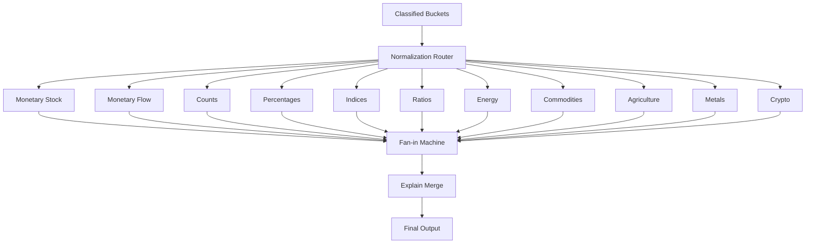
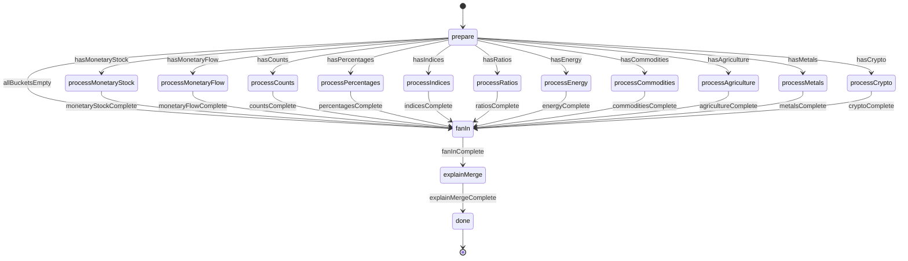
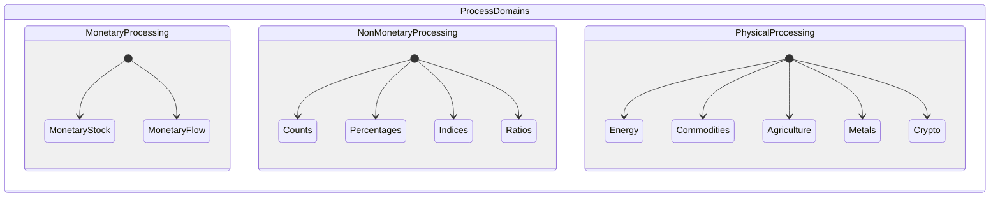
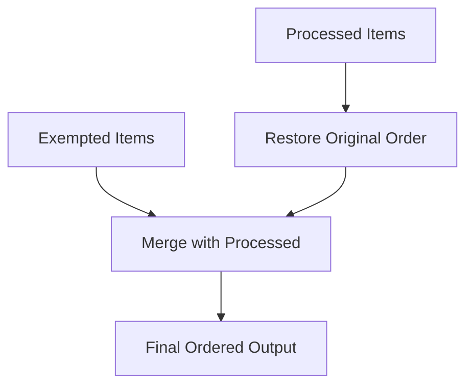
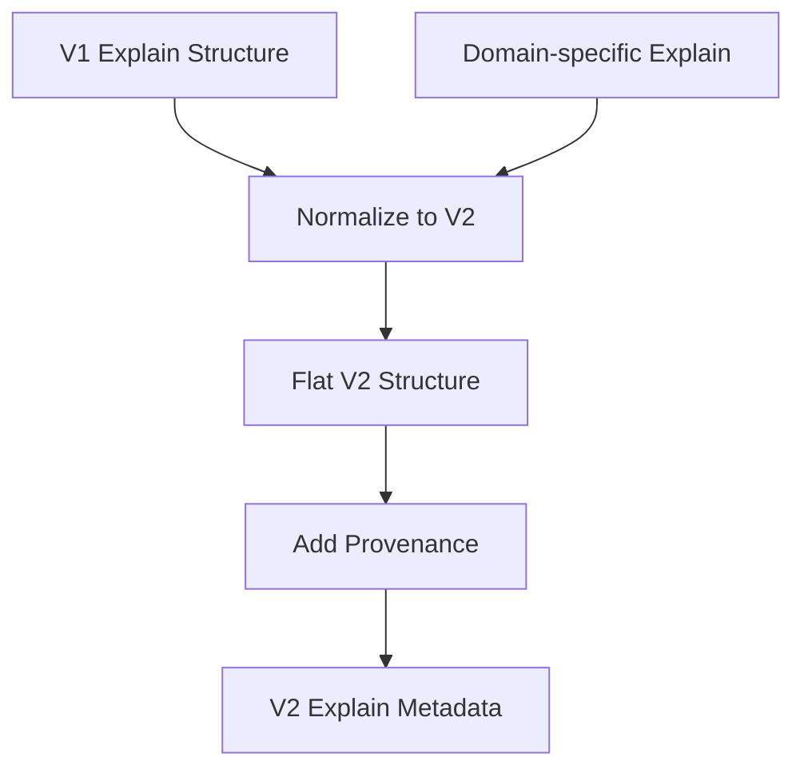
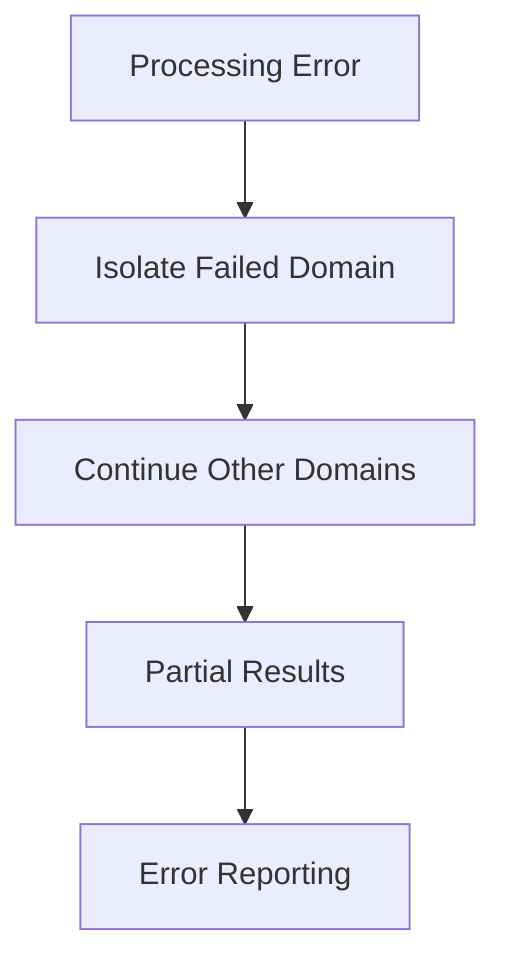

# Normalization Router

The normalization router orchestrates domain-specific processing using a
fan-out/fan-in pattern. It routes classified items to appropriate domain
processors and merges results while preserving order.

## Architecture



## Router Machine (`normalize_router.machine.ts`)

### State Flow



### Guards

The router uses guards to determine which domain processors to invoke:

```typescript
// Guard examples
hasMonetaryStock: (({ context }) => context.buckets.monetaryStock?.length > 0);
hasMonetaryFlow: (({ context }) => context.buckets.monetaryFlow?.length > 0);
hasCounts: (({ context }) => context.buckets.counts?.length > 0);
// ... etc for all domains
```

### Parallel Processing

The router processes domains in parallel where possible, using XState's parallel
states for independent domains:



## Fan-in Machine (`fanin.machine.ts`)

Restores original order and merges processed results with exempted items.

### Order Preservation



### Algorithm

1. **Collect Results**: Gather all processed items from domain processors
2. **Restore Order**: Sort items back to original input order using item IDs
3. **Merge Exempted**: Insert exempted items at their original positions
4. **Validate Completeness**: Ensure no items were lost during processing

## Explain Merge Machine (`explain_merge.machine.ts`)

Normalizes explain metadata to V2 flat structure and adds provenance
information.

### V2 Explain Structure

```typescript
interface ExplainV2Metadata {
  explainVersion: "v2";
  currency?: {
    original: string;
    normalized: string;
    conversionRate?: number;
  };
  scale?: {
    original: string;
    normalized: string;
    factor?: number;
  };
  periodicity?: {
    original: string;
    normalized: string;
    factor?: number;
    direction?: "up" | "down" | "none";
  };
  fx?: FXExplainMetadata;
  autoTarget?: AutoTargetMetadata;
  router?: RouterProvenance;
  domain?: string;
}
```

### Explain Normalization Process



## Domain Processors

### Monetary Domains

- **Monetary Stock**: Full currency + magnitude normalization
- **Monetary Flow**: Currency + magnitude + time basis normalization

### Non-Monetary Domains

- **Counts**: Magnitude scaling only, preserve count units
- **Percentages**: Pass-through, preserve percentage values
- **Indices**: Pass-through, preserve index points
- **Ratios**: Pass-through, preserve ratio values

### Physical Domains

- **Energy**: Pass-through, preserve energy units (TWh, bcm, etc.)
- **Commodities**: Pass-through, preserve commodity units
- **Agriculture**: Pass-through, preserve agricultural units
- **Metals**: Pass-through, preserve metal units
- **Crypto**: Selective normalization for crypto-specific units

## Error Handling

### Graceful Degradation

- **Empty Buckets**: Skip processing for empty domain buckets
- **Processing Errors**: Isolate errors to specific domains
- **Partial Failures**: Continue processing other domains if one fails

### Error Recovery



## Performance Optimizations

### Parallel Processing

- Independent domains processed in parallel
- Reduces total processing time
- Better resource utilization

### Lazy Evaluation

- Only invoke processors for non-empty buckets
- Skip unnecessary computation
- Faster processing for sparse datasets

### Memory Efficiency

- Stream processing where possible
- Minimal intermediate data structures
- Garbage collection friendly

## Usage Example

```typescript
import { createActor } from "xstate";
import { normalizeRouterMachine } from "./normalize_router.machine.ts";

const actor = createActor(normalizeRouterMachine, {
  input: {
    buckets: {
      monetaryStock: [/* GDP items */],
      monetaryFlow: [/* wage items */],
      percentages: [/* rate items */],
      exempted: [/* exempted items */],
    },
    config: {
      targetCurrency: "USD",
      targetMagnitude: "millions",
      explain: true,
    },
  },
});

actor.start();
```

## Testing

Router testing covers:

- All domain routing scenarios
- Empty bucket handling
- Order preservation
- Explain metadata normalization
- Error isolation and recovery
- Performance with large datasets

## Migration from V1

### Key Improvements

1. **Explicit Routing**: Clear state transitions instead of imperative routing
2. **Parallel Processing**: Better performance through parallelization
3. **Order Preservation**: Guaranteed order maintenance
4. **Enhanced Explain**: V2 flat explain structure with provenance
5. **Error Isolation**: Better error handling and recovery

### Compatibility

- Input bucket format compatible with V1 classification
- Output format enhanced with V2 explain metadata
- All V1 functionality preserved with improved performance
